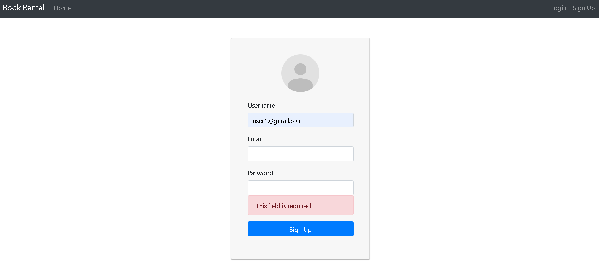

# Book Portal App
A book portal web application created with **Java** & **Spring Framework**  for backend and **React.JS JavaScript** framework for frontend side.

User authentication managed with JWT.

- [Java 17](https://www.oracle.com/java/technologies/downloads/#java17)
- [Spring Framework Boot 2.6.2](https://spring.io/projects/spring-boot)
- [JWT 0.9.1](https://mvnrepository.com/artifact/io.jsonwebtoken/jjwt/0.9.1)

### Project Requirements

- [x]  Admins/users can login to system
- [x] Admin should be able to:
- Add/delete/update books, users, authors
- Search for books and users
- [x] Users should be able to:
- See book list
- Add/remove books from read/favorite list
- Search book by name

#### Extras
- [x] OpenLibrary Book Search API added to public access. Everyone can search books online and 5 result will be shown on the screen.
- [x] Error handling & form validations
- [x] Easy author, books management

Screenshots:

  Login Page:

 

  

  Register Page(Only can register as a user)

  

Home Page

  

    Profile Pages for users and admins

  

  

  

  Admin User Management Page

  

  Admin Add User Page

  

  Admin Edit User Page

  

  Admin Edit Own Account Page(Role select hidden)

  

  Admin Edit User Completed Page(will be redirected to user list page after 5 seconds)

  

  Admin Book Management Page

  

  User Book Management Page

  

  Admin Add Book Page

  

  Admin Add Book Error

  

  Admin Edit Book Page

  

  

    Admin Author Management Page

  

  

 

  Admin Add Author Page

 

  

 

  Admin Add Book to Author Page

  

  Admin Edit Author Page

  

  Database diagram

  

